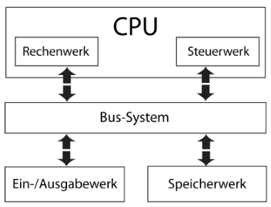

Ein Betriebssystem ist ein Softwarepaket, welches alle *nötigen Softwareinhalte beinhaltet* um ein *Computersystem anwendungsorientiert* einsetzten zu können. Es hat folgende Aufgaben: *Prozessverwaltung, Synchronisation, Benutzerverwaltung, Daten-/Speicherverwaltung und Hardwareverwaltung* bzw. -steuerung.

# Benutzerverwaltung
Unter Windows 10 lassen *sich lokale Benutzeraccounts über lokale Benutzergruppen organisieren*. Vom System werden standardmäßig mehrere Benutzergruppen und Benutzeraccounts für die Unterscheidung von Administratorzugängen angelegt.

Die Organisation kann z.B. bei der Abbildung von Unternehmensstrukturen (eher in einer Domäne) hilfreich sein. Jeder Gruppe lassen sich eigene Richtlinien zuordnen, welche beispielsweise für SMB-Freigaben genutzt werden können. Für jegliche Richtlinien gilt: *Eine Richtlinie die einen Zugriff verweigert* (`DENY`) *steht über jedem zugelassenen Zugriff* (`ALLOW`) für den bestimmten Pfad.

Um diese Organisationseinheiten zu bearbeiten, öffnet man in Windows (Pro-Version vorausgesetzt) die „Computerverwaltung“. Hier lassen sich neue Gruppen und Benutzer erstellen sowie bearbeiten.