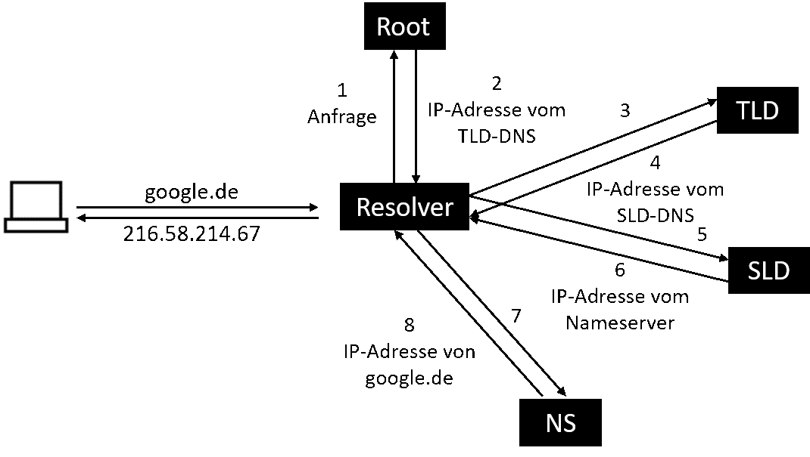
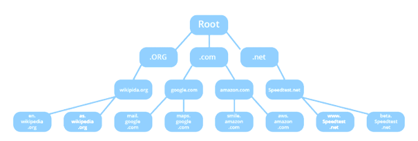

Das Domain Name System, kurz DNS, wird auch als "*Telefonbuch des Internets*" bezeichnet. Ähnlich wie man in einem Telefonverzeichnis nach einem Namen sucht, um die Telefonnummer heraus zu bekommen, *schaut man im DNS nach einem Computernamen*, um die dazugehörige IP-Adresse zu bekommen. Die IP-Adresse wird benötigt, um eine Verbindung zu einem Server aufbauen zu können, über den nur der Computername bekannt ist.

Das Domain Name System ist ein System zur *Auflösung von Computernamen in IP-Adressen* und umgekehrt. DNS kennt *keine zentrale Datenbank*. Die Informationen sind auf vielen tausenden  Nameservern (DNS-Server) verteilt. Die Datei „hosts“ ist eine *lokale Konfigurationsdatei* in Clientsystemen, um Hostnamen zu IP-Adressen zuzuordnen. Diese System-Datei wurde ursprünglich an Stelle des Domain Name System verwendet.

# URL

Am Ende einer aufzulösenden Domain steht *immer der Root „.“*, dieser ist für die Auflösung
essentiell ist aber meist durch Anwendungen ausgeblendet. *Das folgende Schema wird für jede
mögliche Domain angewendet*. Bei feststehenden zweigeteilten Domainendungen wie z.B. „co.uk“
ist „.co“ die SLD und „.uk“ die TLD. Jede Subdomain wie „www“ kann als Host gedeutet werden.

# Records
| Bezeichnung | Anwendung                           |
|-------------|-------------------------------------|
| A-Record    | Auflösung von IPv4-Adressen         |
| AAAA-Record | Auflösung von IPv6-Adressen         |
| MX-Record   | Verweis auf zuständigen Mail-Server |
| NS-Record   | Verweis auf andere Nameserver       |
| TXT-Record  | Rückgabe von gespeichertem Klartext |
