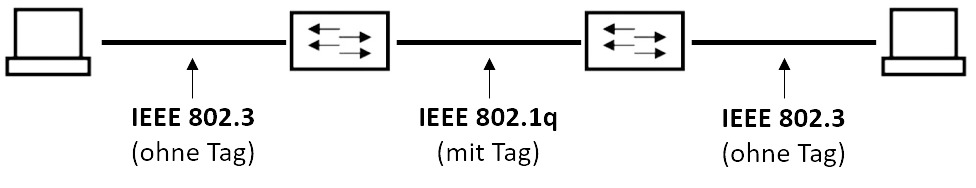

Ein „Virtual Local Area Network“ (VLAN) ist ein *logisches Teilnetz* innerhalb eines Switches bzw. eines gesamten physischen Netzwerks. Es kann sich *über mehrere Switches hinweg* ausdehnen. Ein VLAN trennt physische Netze in virtuelle Teilnetze auf, indem es dafür sorgt, dass *VLAN-fähige Switches* Pakete nicht in ein anderes VLAN weiterleiten obwohl die Teilnetze an gemeinsamen Switches angeschlossen sein können. Die Zuordnung der Teilnetze zu einem VLAN kann statisch über *Portzuordnung* an den Switches erfolgen, über *spezielle Markierungen an den Paketen* realisiert sein oder dynamisch erfolgen. Jedes VLAN bildet (wie ein normales, physisch separiertes Teilnetz) eine eigene Broadcastadresse, durch die Virtualisierung arbeitet VLAN hingegen auf der *2. OSI-Schicht*.

Um den Netzwerkverkehr zwischen den VLANs zu routen, benötigt man einen Router oder einen L3-Switch. Um die Kommunikation zwischen VLANs direkt auf anliegenden L3-Switches durchführen zu können, müssen diese konfiguriert werden, andernfalls wird der Netzwerktraffic als *Inter-VLAN-Routing* immer erst zum Router geleitet. In der Konfiguration der L3-Switches werden sog. SVIs („Switch Virtual Interfaces“) konfiguriert, welche als virtuelle IP-Client auftauchen und ein 1:1-Mapping zwischen einem bestimmten VLAN und dem SVI (ugs. VLAN-Interface) durchführt.

# Portbasiertes VLAN
Portbasierte VLANs sind die *Urform der VLANs*. Hier wird mit L3-Switches ein physisches Netzwerk portweise in mehrere logische Netzwerke segmentiert, indem ein Port einem VLAN fix zugeordnet wird. Im Frame vorhandene Tags werden vom Switch entfernt bevor dieses weitergeleitet wird. Man spricht hier daher von einem *untagged* Port.

# Tagged VLAN
Die paketbasierten tagged VLANs stehen im Unterschied zu den älteren markierungslosen, portbasierten VLANs. Es handelt sich also bei tagged VLANs um Netzwerke, die Netzwerkpakete verwenden, welche eine zusätzliche VLAN-Markierung tragen.

Der Vorteil von Tagged VLAN portbasiertem VLAN findet sich in der Verbindung zwischen verschiedenen Switches: Bei portbasiertem VLAN müssen mindestens zwei Kabel zwischen den Switches verlegt werden, da jedes VLAN seine eigene Verbindung braucht. Mit *Trunking* in Tagged VLANs reicht ein Kabel (der Trunk), da die Verteilung über die Informationen des Tags funktioniert.

Durch die Tags werden VLAN-spezifische Informationen zum Frame hinzugefügt. Zu dieser Gattung gehören die VLANs nach IEEE 802.1q. Damit die VLAN-Technik nach 802.1q auch für ältere Rechner und Systeme in einem Netz transparent bleibt, müssen Switches diese Tags bei Bedarf hinzufügen und auch wieder entfernen können. Der Tag ist im Paket hinter der MAC-Adresse gespeichert.

