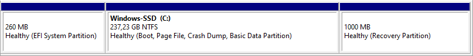

# Partitionierung
Partitionen sind logisch getrennte Datenblöcke auf einem Speichermedium. Jede Partition ist in einem *Dateisystem* (z.B. NTFS oder FAT32) formatiert, damit diese beschreibbar ist.

## EFI-Partition
Die EFI-Partition ist eine Systempartition, welche nicht vom Nutzer beschreibbar ist. Die Aufgabe dieser Partition ist die *Bereitstellung von Treibern der Peripheriegeräte für das UEFI* (BIOS mit UI).

