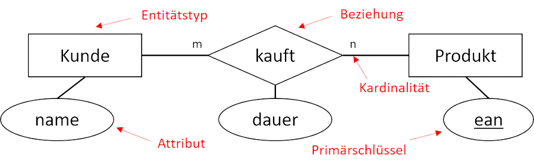

# Entity-Relationship-Diagram
Ein „Entity-Relationship-Diagram“ (kurz ERD) bzw. „Entity-Relationship-Modell“ (kurz ERM) ist eine visuelle Darstellung verschiedener Entitäten innerhalb eines Systems mit ihrer Beziehung zueinander.

## Konventionen
- **Entitätstypen** werden groß und im Singular geschrieben. 
- **Attribute** werden klein und eindeutig geschrieben. (Primärschlüssel unterstreichen) 
- **Beziehungen** werden klein und in Leserichtung geschrieben. 
- Keine Verwendung von Umlauten und Sonderzeichen (inklusive Leerzeichen).
