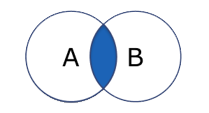
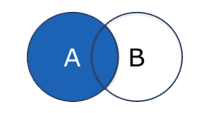
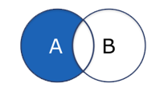

Joins führen *Daten zusammen, die in unterschiedlichen Tabellen* gespeichert sind, und geben diese in gefilterter Form in einer Ergebnistabelle aus. Welche Daten der Ausgangstabellen in die Ergebnis-Tabelle übernommen werden, bestimmt der Anwender durch die Wahl eines *Join-Typs* und durch die Definition einer Selektionsbedingung. Voraussetzung dafür ist, dass die ausgewählten Tabellen über *Fremdschlüsselbeziehungen* miteinander verknüpft sind. Die Selektionsbedingung kann alternativ mithilfe des Schlüsselwortes USING realisiert werden, Voraussetzung ist dieselbe Bezeichnung des Primär- und Fremdschlüssels in beiden referenzierten Tabellen.

``` sql
# Bei gleinamigen PK und FK
SELECT * FROM Mitarbeiter JOIN Abteilung USING(AbteilungsID);

# Bei unterschiedlicher Benamung
SELECT * FROM Mitarbeiter AS m JOIN Abteilung AS a 
	ON m.AbteilungsID = a.ID;
```

## Arten von Joins
| Join-Anweisung        | Visualisierung | SQL-Statement                                                                                   |
| --------------------- | -------------- | ----------------------------------------------------------------------------------------------- |
| `(INNER) JOIN`          |  | `SELECT * FROM table_a JOIN table_b USING(key);`                                |
| `LEFT/RIGHT INNER JOIN` |  | `SELECT * FROM table_a LEFT JOIN table_b USING(key);`                           |
| `LEFT/RIGHT OUTER JOIN` |  | `SELECT * FROM table_a RIGHT JOIN table_b USING(key);` |
### INNER-Join & OUTER-Join
- **INNER-Join**: Bei einem `INNER JOIN` handelt es sich um eine *gefilterte Form des Joins*, bei der in der Ergebnismenge nur die Tupel beider Ausgangstabellen zusammengeführt werden, die die vom Anwender definierte *Selektionsbedingung erfüllen*.
- **OUTER-Join**: Der `OUTER JOIN` stellt eine Erweiterung des `INNER JOINS` dar. Ergebnismenge eines `OUTER JOINS` enthält die Tupel beider Ausgangstabellen, die die vom Anwender definierte *Selektionsbedingung erfüllen*, *wie auch* *alle restlichen Tupel* der ersten Tabelle, der zweiten Tabelle oder beider Tabellen. `OUTER JOINS` werden entsprechend als `LEFT OUTER JOIN`, `RIGHT OUTER JOIN` oder `FULL OUTER JOIN` realisiert.
### EQUI-Join & NON-EQUI-Join
- **EQUI-Join**: Alle bisher vorgestellten `JOIN`-Beispiele stellen `EQUI JOINS` dar. `EQUI JOINS` sind dadurch gekennzeichnet, dass sie ausschließlich das *Gleichheitszeichen* *als Vergleichsoperator zulassen*.
- **NON-EQUI-Join**: `NON EQUI JOINS` schließen Operationen auf Basis der Gleichheit von Spalten aus. Es sind somit *alle Vergleichsoperationen mit Ausnahme des Gleichheitszeichens* erlaubt.
### SELF-Join
Der Self-Join ist ein Join *einer Tabelle mit sich selber*. Er wird oft in *rekursiven Abfragen* verwendet. Ein Self-Join ist ein orthogonales Konzept zu den anderen Join-Typen, da er sich auf die verwendete Tabelle bezieht. Er kann daher *zusätzlich mit jedem anderen Join-Typ übereinstimmen*, d.h. es gibt Self-Joins, die zusätzlich `Inner-Joins` sind oder `Outer-Joins` usw.
