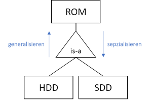
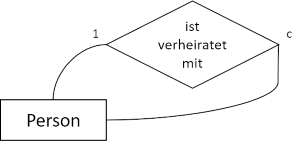

# Spezielle Beziehungstypen

## Generalisierung (is-a)

siehe [[Generalisierung|Generalisierungsauflösung]]

**Disjunktheit**
- *disjunkt*: Kein Element mehreren Teilmengen vor.
- *nicht-disjunkt*: Die Teilmengen enthalten gemeinsame Elemente.

**Vollständigkeit**
- *total*: Es gibt keine weiteren Teilmengen (in der Spezialisierung).
- *partiell*: Nicht alle Teilmengen sind aufgeführt.

## Aggregation (part-of)

## Rekursion

