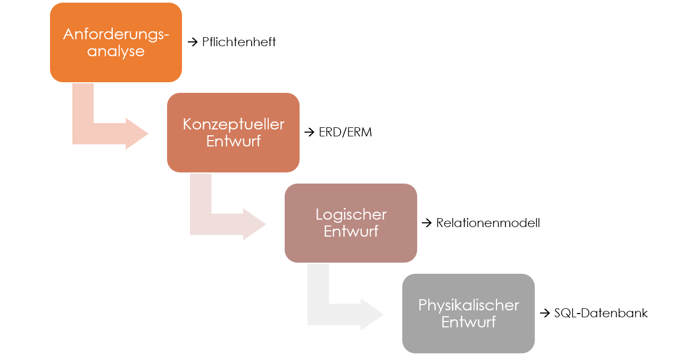

# Konzeptuelles Wasserfallmodell

## Vorteile
- Bessere Zeitabschätzung (Überblick über anfallende Kosten)
- Bei kleinen Projekt soll es weniger Abbrüche geben
- Einfache Möglichkeit von Planung und Kontrolle
- Analyse ermöglicht eine detaillierte Beschreibung von Vorstellungen

## Nachteile
- Sehr unflexible Vorgehensweise
- Hohe Kosten bei unerwarteten Problemen
- Bei großen Projekten kann es eher zum Scheitern kommen.
- Der Auftraggeber wird nicht bis zur Abnahme benötigt.
- 'Return of Investment' kommt sehr spät
- Fehler werden spät erkannt
- Die Analyse kann später nicht mehr geändert werden.
