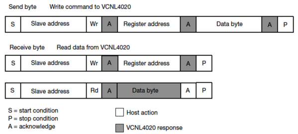

# Busprotokolle
Ein Datenbus besteht typischerweise aus mehreren Datenleitungen. Die *Hauptkomponente* (engl. „Master“) *legt auf einer Leitung den Takt fest*. Die *Datenleitung wird von allen Komponenten benutzt*, um Daten zu senden und zu empfangen. Es lassen sich mehrere Komponenten mit einem Datenbus verbinden. Die Hauptkomponente schickt mit den ersten Byte (*Slave-Adresse*) des zu adressierenden Knoten (engl. „Slave“). Dabei wird auch selektiert, ob der Konten Daten von der Hauptkomponente lesen soll oder zu ihr schicken. Es lassen sich unterschiedliche elektronische Bauteile verwenden, die den Datenbus unterschiedlich nutzen.

Im Mikrocontrollerbereich werden vor allem *drei Busprotokolle eingesetzt*: 1-Wire, I²C, SPI. 1-Wire ist ein schmales Busprotokoll, welches nur eine *Leitung plus Ground* benötigt. I²C ist *sehr effizient* in der Datenverarbeitung und benötigt dafür nur zwei Leitungen. SPI ist *sehr schnell*, jedoch aufwendiger und kann auf vier Leitungen per vollduplex mit bis zu 400 MHz Bits übertragen.


## I²C
Der I²C-Bus verwendet nur zwei bidirektionale Leitungen, die serielle Datenleitung `SDA` (engl. „Serial Data“) und eine serielle Taktleitung `SCL` (engl. „Serial Clock“). I2C-kompatible Geräte werden mit „Open Collector“ oder „Open Drain“ an den Bus angeschlossen, wodurch die Leitung auf `LOW` gezogen wird. Wenn keine Datenübertragung auf dem I2C erfolgt, sind die Busleitungen in einem `HIGH`-Zustand.

Teilnehmer des I²C-Bus können die `SDA`-Leitung gegen `LOW` ziehen oder sich passiv verhalten. Der Bus wird im Leerlauf automatisch auf `HIGH` gesetzt. Dadurch wird ein gleichzeitiges Zugreifen von Teilnehmern elektrisch ermöglicht.

### Timing-Diagramm


### Read/Write-Funktion


``` c
#include i2c_api.h 

void writeData(unsigned char address, unsigned char data) 
{ 
	i2c_start(); 
	i2c_write(0b00100110); 
	i2c_write(address); 
	i2c_write(data); 
	i2c_stop(); 
} 

unsigned char readData(unsigned char address) 
{ 
	i2c_start(); 
	i2c_write(0b00100110); 
	i2c_write(address); 
	i2c_stop(); 
	
	i2c_start(); 
	i2c_write(0b00100111); 
	unsigned char data = i2c_read(); 
	m_ack(); 
	i2c_stop(); 
	
	return data; 
}
```
