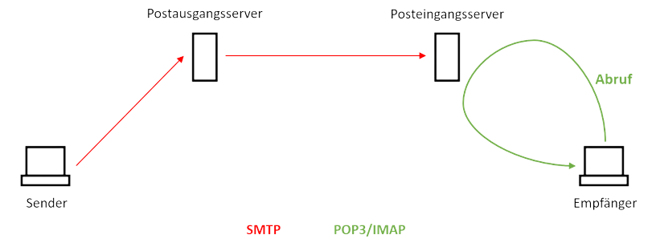

# E-Mail
E-Mail (engl. „electronic Mail“) ist der Standard für ausschließlich digitalen Schriftverkehr. Der Aufbau einer E-Mail-Adresse sieht wie folgt aus: `name@domain.tld` und ist *nicht case-sensitive*.

Die Kommunikation erfolgt über die Protokolle *SMTP, POP und IMAP*. Solange eine E-Mail versandt wird und noch nicht im Ziel-Postfach liegt, wird das SMTP verwendet. Für das Abrufen der E-Mail wird das POP3 oder IMAP verwandt. IMAP ist ein alternatives Protokoll zu POP3, welches den Posteingansserver um Funktionen wie ein lokales Ablageverzeichnis zum langfristigen Speichern von E-Mails und der Möglichkeit des selektiven Abrufens von E-Mails erweitert.

Die E-Mail-Kommunikation erfolgt über einen Client und *mindestens einen Server*. Hier unterscheidet man zwischen dem *Posteingangsserver* (Empfang von E-Mails) und dem  (Senden von E-Mails), wobei es sich um unterschiedliche Server handeln kann

| Protokoll | Port     |
|-----------|----------|
| POP3      | 110, 995 |
| SMTP      | 25, 165  |
| IMAP      | 143, 993 |

**Technischer Ablauf**:
- Gegenseitige Begrüßung nach ARP, Three-Way-Handshake (TCP) 
- Der Inhalt (Sender, Empfänger, …) war lesbar (unverschlüsselt) 
- Der Mailserver sucht zuerst nach dem DNS-Server 
- E-Mail wird in mehrere Pakete aufgeteilt und übertragen 
- E-Mail wird nach dem Prinzip einer Warteschlange (engl. Queue bzw. `FIL0`) verarbeitet

