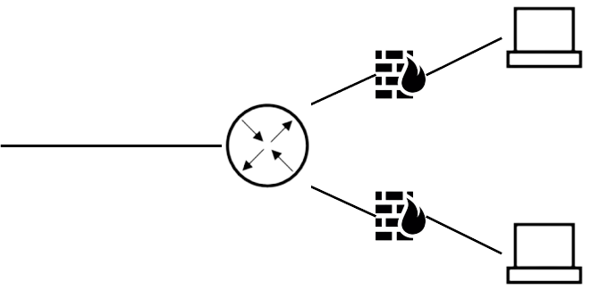
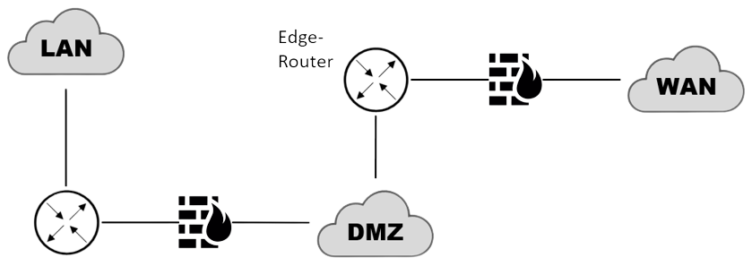

Eine Firewall ist ein Sicherungssystem, das ein Rechnernetz oder einen einzelnen Computer *vor
unerwünschten Netzwerkzugriffen schützt*. Mit einer Firewall lässt sich der kommende und gehende Datenverkehr *kontrollieren, protokollieren, sperren und freigeben*.

# Access Control List
Die Regeln für die Firewall werden in der „Access Control List“ (kurz ACL) definiert. *Die Reihenfolge der Regelsätze ist relevant* für die Ausführung. Die erste Regel, die für ein Datenpaket greift, wird angewendet – weitere Regeln werden in solchen Szenarien nicht beachtet. 

Man unterscheidet zwischen dem *Zero-Trust-Prinzip*, der Whitelist (blockiert jegliche Pakete, welche nicht explizit freigegeben sind) und der Blacklist (Erlaubt jegliche Pakete, was nicht expliziert blockiert wurde), welche den Netzwerkverkehr filtern.

| Erlaubnis | Quelladresse  | Protokoll | Zieladresse  | Port |
|-----------|---------------|-----------|--------------|------|
| ALLOW     | 161.72.160.27 | TCP       | 192.168.0.17 | 80   |
| ALLOW     | 161.72.160.20 | UDP       | ANY          | 2102 |
| DENY      | ANY           | ANY       | ANY          | ANY  |

Beispiel für eine portbasierte Regel (auch Portfreigabe) je nach Protokoll:

| Erlaubnis | Quelladresse | Protokoll | Zieladresse | Port |
|-----------|--------------|-----------|-------------|------|
| ALLOW     | ANY          | TCP       | ANY         | 22   |
| ALLOW     | ANY          | UDP       | ANY         | 22   |

# Konzepte

## Stateless
Stateless Firewalls analysieren den Netzwerkverkehr auf Paketebene, ohne dabei den Verbindungszustand zu berücksichtigen. Jedes einzelne Paket wird isoliert betrachtet, und Entscheidungen bezüglich der Weiterleitung oder Blockierung basieren auf vordefinierten Regeln, die auf den individuellen Paketen angewendet werden. 
Der Fokus liegt dabei auf der Prüfung der Header-Informationen, wie Quell- und Ziel-IP-Adressen, Portnummern und Protokolltypen. Dies ermöglicht eine effiziente, wenn auch weniger kontextsensitive Überwachung des Datenverkehrs.
## Stateful
Im Gegensatz dazu berücksichtigen Stateful Firewalls den Verbindungszustand und analysieren den Datenverkehr auf einer höheren Ebene. Hierbei werden Informationen über den Zustand der Netzwerkverbindungen gespeichert und verwendet, um Entscheidungen zu treffen. Die Firewall verfolgt den gesamten Kommunikationsfluss und kann anhand dieses Kontexts differenzierte Entscheidungen treffen. Dies ermöglicht eine genauere Identifizierung von erlaubtem oder unerlaubtem Datenverkehr. 
Stateful Firewalls bieten somit eine erhöhte Sicherheit, insbesondere bei komplexen Netzwerkanwendungen.

Eine Stateful Packet Inspection Firewall legt eine State-Tabelle an, die alle Zustände von eingehenden und ausgehenden Verbindungen verzeichnet. Dies ermöglicht der Firewall, legitime Pakete von ungültigen zu unterscheiden und schützt vor Angriffen, bei denen Pakete mit gefälschten ACK-Flags gesendet werden, da diese in der State-Tabelle keine passende ausgehende Anfrage eines geschützten Rechners finden würden, und solche Pakete werden abgelehnt.

### IP-Fragmentierung
Ein spezifisches Detail in der stateful Firewall ist die Berücksichtigung von IP-Fragmentierung. Dies bezieht sich auf die Aufteilung von IP-Paketen in kleinere Fragmente, um den Datenaustausch über Netzwerke mit unterschiedlichen maximalen Paketgrößen zu ermöglichen. Die Firewall kann diese Fragmente überwachen und sicherstellen, dass sie korrekt wieder zusammengefügt werden.
## Proxy/Application
Firewalls können auch als Proxy dienen, wodurch sie als Vermittler zwischen internen und externen Netzwerken fungieren. Diese Proxies können auf Anwendungsebene arbeiten, indem sie den Datenverkehr auf Anwendungsprotokollebene analysieren. Dadurch können spezifische Anwendungsregeln angewendet werden, um den Datenverkehr zu steuern und potenzielle Bedrohungen zu erkennen.

# Umgebungen
## Hostbasierte Firewall
Die hostbasierte (engl. „host basted“) Firewall ist ein Softwareprodukt, welches nur den Client mit der entsprechenden Installation schützt.

## Netzwerkbasierte Firewall
Die netzwerkbasierte (engl. „network based“) Firewall kann eine Software- oder Hardwarelösung sein, welche das gesamte Netzwerk vor externen Zugriffen schützt.

# DMZ
Die Abkürzung DMZ steht für „demilitarisierte Zone“ und bezeichnet einen *speziell kontrollierten Netzwerkteil*, der sich *zwischen dem externen* und dem internen Netz befindet. Es stellt eine Art Pufferzone dar, die die Netze durch strenge Kommunikationsregeln und Firewalls voneinander trennt.

In der demilitarisierten Zone befinden sich Server wie *Webserver, Mailserver, Authentication-Server oder Anwendungsgateways*. *Nur diese sind für User aus dem Internet erreichbar*. Durch die Trennung der DMZ vom internen Netz ist kein Zugriff für externe Anwender auf interne Ressourcen möglich. Das private Netzwerk bleibt vor *Angriffen aus dem Internet* oder vor Überlastung durch Internetanfragen geschützt. Die demilitarisierte Zone kann durch eine oder mehrere Firewalls von den angrenzenden Netzwerken separiert sein.

## 1-Firewall DMZ
Vorteile einer 1-Firewall-DMZ sind der geringere Konfigurations- und Administrationsaufwand durch die günstige Anschaffung nur eines Geräts ([[Komponenten#Router|Router]]). Nachteile ist der Wegfall der Sicherungseinheit durch die fehlende zweite Firewall.

## 2-Firewall-DMZ
Die 2-Firewall-DMZ ist der DMZ-Standard für größere Netzwerke. Die Besonderheit liegt in der zweifachen Filterung des Netzwerkverkehrs furch Firewalls, vor und nach der DMZ. Nachteil der Konfiguration im Vergleich zur 1-Firewall-DMZ liegt im erhöhten Preis und Administrationsaufwand.

In beiden Firewall-Routern müssen *statische Routen* konfiguriert werden, damit die eingehenden Datenpakete der Verbindungen an die richtigen Hosts im LAN zugestellt werden können.
