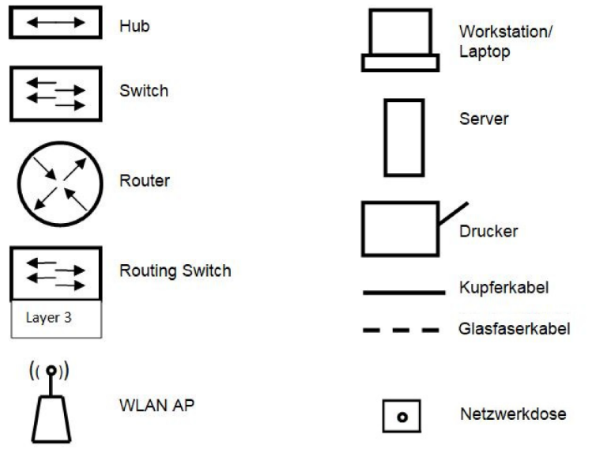

# Hub
Ein Hub ist eine veraltete Netzwerkkomponente, er empfängt Signale und leitet sie an alle angeschlossenen Geräte weiter. Der Hub kennt keine MAC-Adressen und verursacht viele Kollisionen im Datenverkehr. Der Hub ist ein *rein elektrisches Bauteil*, welches über keinen Prozessor und Speicher verfügt – er ist „dumm“ und arbeitet auf der 1./2. OSI-Schicht.

# Switch
Switches (auch L2-Switch) sind „kluge“ Netzwerkkonten. Ein Switch *vermeidet Kollisionen*, indem er Blöcke speichert und nur an das Zielgerät weiterleitet. Dazu greift der Switch die Daten aus den gesendeten Paketen ab und liest die Quell-, und Ziel-MAC-Adresse aus. Der Switch registriert die *MAC-Adressen* der angeschlossenen Netzwerkgeräte und speichert diese in einer Tabelle. Switches arbeiten auf der 2. OSI-Schicht, werden teilweise auch in die 3. OSI-Schicht eingeordnet. Jeder Switch verfügt über CPU, RAM und ASICS (Application Specific Integrated Circuits).

# Portsecurity
Portsecurity ist ein zusätzliches Sicherheitsfeature mancher Switches. Es öffentlich zugängliche LAN-Ports entweder ganz zu deaktivieren oder gegen eine MAC-Filterliste prüfen zu lassen.

# Router
Router sind die komplexesten Netzwerkkomponenten, sie verwalten den Datenverkehr des internen IP-Subnetztes sowie den Datenverkehr ins Internet. Der Router achtet auf die IP-Adresse und nicht die MAC-Adresse des eingegangenen Pakets. Bei der Weiterleitung von Datenverkehr ins Internet geht der Router wie folgt vor: Er *ändert die Quell-MACAdresse in seine eigene MAC-Adresse und die Ziel-MAC-Adresse in die des Zielrechners. Der Router verbindet die Netzwerke* untereinander und arbeiten damit auf der Vermittlungsschicht (3.OSI-Schicht). Router unterstützen für Routingvorgänge nötige WAN-Protokolle.

# Layer3-Switch
Layer3-Switches (kurz L3-Switch) bzw. Managed Switches oder Routing Switch sind eine Weiterentwicklung des L2-Switches, welche koexistiert. Der herkömmliche Switch wird mit einer limitierten Routingfunktionalität auf die 3. OSI-Schicht gehoben. Im Unterscheid zum Router, verbindet ein L3-Switch nur Subnetze und unterstützt keine WAN-Protokolle. L3-Switches arbeiten durch effizientes Zwischenspeichern von Paketrouten besonders schnell - nach dem Prinzip „Route once, switch many“. Der Erwerb von L3-Switches ist im Vergleich zu L2-Switches deutlich teurer.

# Netzwerksymbolik Abitur
