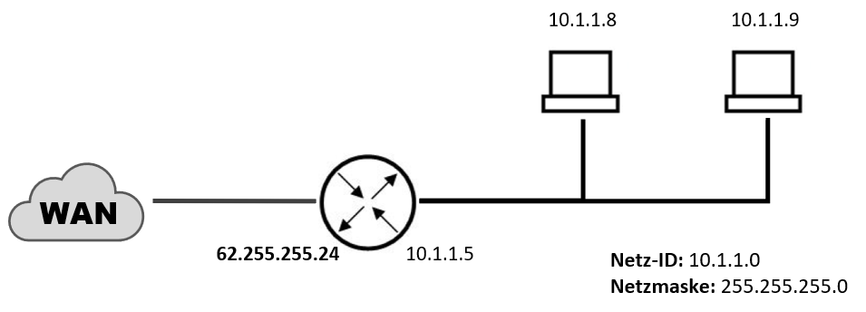

# NAT & PAT
Um mit privaten [[IP-Adressen]] auf das Internet zugreifen zu können, müssen die Anfragen übersetzt und weitergeleitet werden. Dabei kommt das PAT („Port Address Translation”) zum Einsatz, welches seinen Vorgänger, das NAT („Network Address Translation”), abgelöst hat.

Stellt ein Teilnehmer aus dem privaten Netzwerk eine Anfrage ins Internet, so vergibt das PAT einen [[Ports|Port]] für die Anfrage. Der [[Komponenten#Router|Router]] leitet die Anfrage mit seiner öffentlichen [[IP-Adressen|IP-Adresse]] und dem Port (Netzwerksocket) an den Empfänger weiter. Sollte der Empfänger eine Antwort an den Socket senden, empfängt der [[Komponenten#Router|Router]] das Packet und gibt es an das PAT weiter. In der *Tabelle des PAT* kann die Anfrage anhand der Portnummer der Quelle im internen Netzwerk zugeordnet werden. Für die Portvergabe werden in der Regel *sehr hohe Ports* angesetzt. Zu lokalen Clients hinter einem PAT-Router kann von außerhalb keine Verbindung aufgebaut werden (Portfreigabe notwendig).

