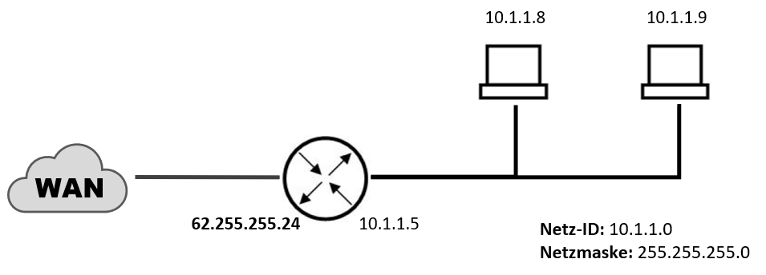

Network Address Translation (kurz NAT) ist ein Verfahren, das in [[Komponenten#Router|Router]] verwendet wird, um lokale Netzwerke mit dem Internet zu verbinden. Es ermöglicht, dass Computer mit privaten [[IP-Adressen]] dennoch auf das Internet zugreifen können, indem der Router ausgehende Datenpakete so modifiziert, dass die private [[IP-Adressen|IP-Adresse]] durch seine öffentliche IP-Adresse ersetzt wird. NAT ist eine temporäre Lösung für die begrenzte Anzahl von [[IP-Adressen#IPv4-Adresse|IPv4-Adressen]] und wird durch [[IP-Adressen#IPv6-Adresse|IPv6]] langfristig abgelöst.

# SNAT
Source Network Address Translation (kurz SNAT) ist eine Anwendung von NAT, bei der der Router die Quelladresse jedes ausgehenden Datenpakets durch seine eigene öffentliche IP-Adresse ersetzt. Dies ermöglicht es Geräten mit privaten [[IP-Adressen]], auf das Internet zuzugreifen. SNAT wird verwendet, um die begrenzte Anzahl von öffentlichen [[IP-Adressen]] effizient zu nutzen.

## PAT
Port Address Translation (kurz PAT) ist eine spezielle Form von NAT, bei der nicht nur die [[IP-Adressen]], sondern auch die Portnummern in den Datenpaketen geändert werden. PAT wird normalerweise im Zusammenhang mit SNAT verwendet, um mehrere private [[IP-Adressen]] auf eine einzige öffentliche [[IP-Adressen|IP-Adresse]] abzubilden, wobei jeder Datenverkehr durch unterschiedliche Ports unterschieden wird. Die offenen Sockets werden, mit den typischerweise hohen Portnummern, in der PAT-Zuordnungstabelle gespeichert.  

# DNAT
Destination Network Address Translation (kurz DNAT) ist eine Form von NAT, die es ermöglicht, dass Hosts mit privaten [[IP-Adressen]] dauerhaft aus dem öffentlichen Netz erreichbar sind. Dies wird durch *Port-Forwarding* erreicht, indem der Router eingehende Datenpakete an einen bestimmten Host im lokalen Netzwerk weiterleitet.
