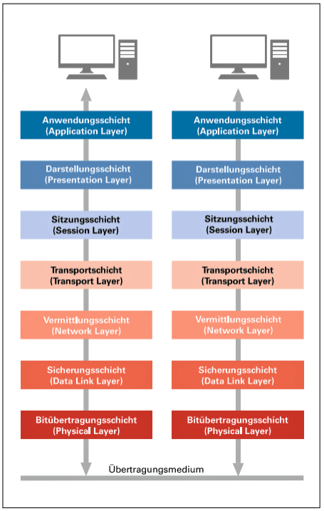
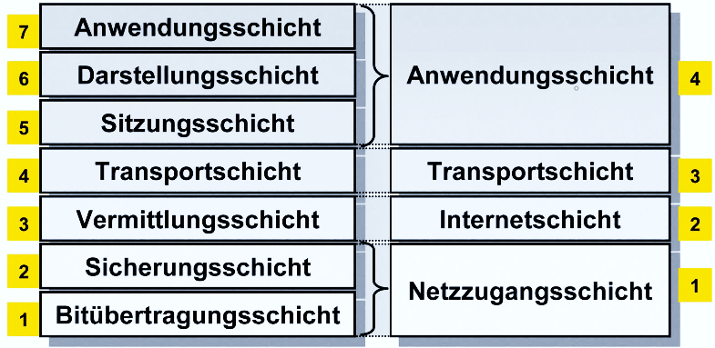

# OSI-Schichtenmodell
Das OSI-Modell ist ein Versuch der Abbildung von Netzwerkkommunikation. Alle Netzwerkakteure lassen sich in eine der 7 OSI-Schichten einordnen. Falls die Einordnung nicht klar ist, wird immer die höchstmögliche Schicht gewählt. Während einer Netzwerkkommunikation wird jede Schicht zwei Mal durchlaufen. Am Anfang bzw. Ende sitzt der Anwender (umgangssprachlich: „Layer: 8“).

> „**A**lle **d**eutschen **S**chüler **t**rinken **v**erschiedene **S**orten **B**ier.“

1. Festlegung der Übertragung einzelner Bits 
   ➔Kabel, Stecker 
2. Fehlererkennung und -korrektur 
   ➔Netzwerkkarten, [[MAC-Adressen]] 
3. Sicherstellung von vorteilhaften Routen 
   ➔[[IP-Adressen]], Paketsplitting
4. Weiterleitung von Datenpaketen 
   ➔TCP/UDP, [[Ports]] 
5. Synchronisierung und Dialogsteuerung 
   ➔Token-Management 
6. Kodierung und Verschlüsslung 
   ➔ASCII, [[Verschlüsselung|AES]] 
7. Schnittstelle zum Anwender 
   ➔[[Protokolle]] (HTTP, FTP, …)

## TCP/IP Referenzmodell

