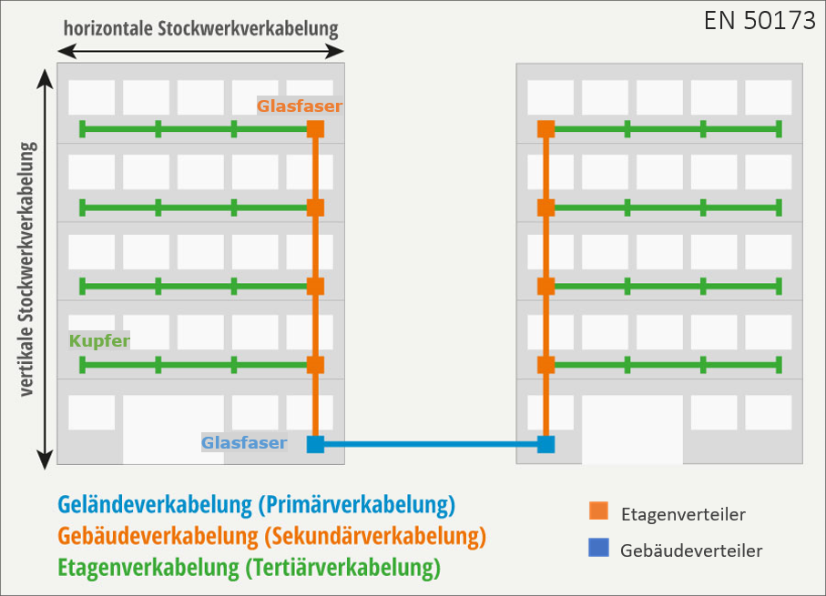

Die strukturierte Gebäudeverkabelung ist in der `DIN EN 50173` geregelt. Die Norm unterteilt Gebäudekomplexe in drei Bereiche, in welchen verschiedene Netzwerkkomponenten und Übertragungsmedien eingesetzt werden.

Im *primären und sekundären Bereich wird Glasfaser eingesetzt*, zu den Endgeräten im tertiären 
Bereich werden Kupferkabel (min. Cat.5e, besser 6(a) oder 7) verlegt. Die angepeilte Struktur ist eine Stern-Stern-Topologie von den Gebäudeverteilern (kurz GVs, L3-Switches) über die Etagenverteilern (kurz EVs, L2-Switches) zu den Clients. Die Primärverkabelung endet/*beginnt am Router zum WAN.*

