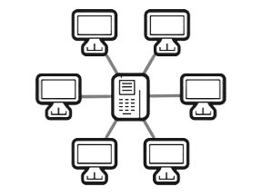
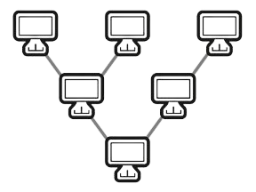

# Topologien
Topologien sind Darstellungen von physikalischen Netzwerkstrukturen. Diese bilden die Grundlage für den Weg des Datentransports auf Bitebene. Alle gezeichten komplexen Topologien (außer Bus) lassen sich für höhere Verfügbarkeit vermaschen.

## Stern
In der Stern-Topologie werden alle Clients mit einem dedizierten Kabel mit einem Sternverteiler (Switch) verbunden. Ein sternförmiges Netz hat einen deutlich höheren Verdatungsaufwand.

## Baum
In der Baum-Topologie werden mehrere Hauptverteiler baumförmig auf weitere Unterverteiler verteilt. Das Netzwerk wird mit jeder Stufe deutlich größer. Diese Topologie wird nicht mehr oft verwendet, da man oft größere Stern-Netzte aufbaut.

## Bus

## Ring

## Zelle (Cell)

## Punkt-zu-Punkt

## Masche

### Vollsätndige Masche

### Vollständige Masche
