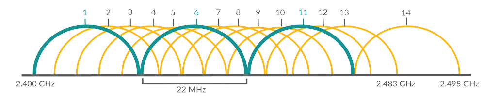

# WLAN
WLAN bzw. „Wireless Local Area Network“ ist der *Oberbegriff für alle Techniken und Standards* mit denen sich lokale drahtlose Funknetzwerke aufbauen lassen. Allerdings wird im allgemeinen Sprachgebrauch der Begriff „WLAN“ für ein Funknetzwerk nach dem *Standard IEEE 802.11* verwendet. International ist für diesen Standard die *Bezeichnung „Wireless Fidelity“ (kurz „Wi-Fi“)* üblich. Die drahtlose Übertragung erhöht die Mobilität und verbessert den Komfort, bei der Nutzung von Geräten. In der Regel ist bildet das WLAN *ein eigenes Subnetz oder VLAN*.

Das Funknetzwerk geht meist *von einem zentralen Punkt kreisförmig* (außer bei einer Richtantenne) aus, auch Basisstation genannt. Als *Basisstationen dienen Access-Points* (kurz APs), welche ein WLAN-Netzwerk aufbauen, diese werden kabelgebunden (per LAN) betrieben. Im Endanwenderbereich werden zur Erweiterung des heimischen WLAN-Signals häufig *WLAN-Repeater* eingesetzt, diese sind schwächere und preiswertere WLAN-APs, mit einer *kabellosen Anbindung* (per WLAN). Um eine WLAN-Netzwerk weiter zu entstören sollte die Sendeleistung zur Minimierung von Interferenzen eingeschränkt, die Antennen ausgerichtet und die Kanalvergabe der APs störungsfrei getrennt werden.

## Standards
### Wi-Fi 4 (2,4 GHz)
Das WLAN im 2,4 GHz-Band ist in IEEE 802.11b (vorher 802.11g/n) geregelt und wurde in 14 Kanäle aufgeteilt, wobei in fast allen Ländern in Europa nur die ersten 13 verwendbar sind. Obwohl der *Kanalabstand* (außer bei Kanal 14) *5 MHz* beträgt, benötigt eine Funkverbindung eine *Bandbreite von 20 MHz*. Um Störungen zu vermeiden, müssen bei räumlich *überschneidenden Funkzellen überlappungsfreie Frequenzbereiche mit einem Abstand von vier Kanalnummern* gewählt werden. Für überlappungsfreie Netzwerke ist daher in Europa die *Kanalkombinationen 1, 6, 11* zu verwenden. Zu berücksichtigen ist, dass die WLAN-Kanäle 9 und 10 nahe am Spitzenwert der Leckfrequenz haushaltsüblicher Mikrowellen (2,455 GHz) liegen und dadurch eine Störung Kanäle möglich ist.

### Wi-Fi 6 (5 GHz)
Das 2.4-GHz-Band zeichnet sich generell durch eine etwas *bessere Reichweite* aus, 5 GHz durch eine  *deutlich höhere Geschwindigkeit*. 5 GHz Netze sind nicht so anfällig auf Störungen wie 2.4 GHz Netze, da das 2.4-GHz-Band oft sehr stark durch WLAN und andere Geräte belegt ist. Die Verfügbarkeit von erweiterbaren Kanälen *erleichtert die Entstörung* zwischen mehreren WLAN-Netzwerken. Da auf Teilen des 5-GHz-Bandes auch noch Wetterradarsysteme laufen, muss ein WLAN-Gerät regelmäßig die Frequenz auf solche Signale überprüfen und allenfalls einen *Frequenzwechsel* initiieren.

## Betriebsarten
### Infrastruktur Modus
Ein Netzwerk im Infrastruktur-Modus benötigt *einen Access-Point*. Der Access-Point *kontrolliert* die drahtlose Kommunikation und bietet mehr Vorteile als ein Ad-hoc Netzwerk. Beispielsweise ist die *Integration in ein kabelgebundenes Netzwerk* deutlich einfacher zu realisieren.

### Ad-hoc Modus
Ein Ad-hoc Netzwerk erlaubt es jedem Gerät *mit jedem anderen direkt zu kommunizieren* (engl. „Peer to Peer“, kurz P2P). Es besteht kein zentraler Access-Point um die Geräte Kommunikation zu kontrollieren. Ad-hoc Netzwerke sind *nur fähig, mit anderen Ad-hoc Geräten zu kommunizieren*, sie sind nicht fähig mit Geräten aus infrastrukturbasieren Netzwerken oder anderen kabelgebundenen Netzwerkgeräten zu kommunizieren. Die Sicherheit des Ad-hoc Modus ist niedriger als ein vergleichbares Infrastruktur-Modus Netzwerk.

## Gefahren
1. Abhören des Paketverkehrs 
2. Anmeldeversuche unberechtigter Benutzer 
3. Unberechtigter Zugriff auf das interne Netzwerk 
4. Verfälschung des Datenverkehrs („Man in the Middle“) 
5. Manipulation der administrativen Einstellungen von Netzwerkhardware

## Maßnahmen
1. MAC-Adressfilter (Whitelist für bekannte Geräte) 
2. Jeder AP erhält ein eigenes (sicheres) Passwort 
3. Einsatz zeitgemäßer Verschlüsslung (WPA2/WPA3) 
4. Änderung der Standard IP-Adresse für kritische Geräte 
5. Regelmäßige Änderung der Anmeldedaten zu Verwaltungsoberflächen 
6. WLAN standardmäßig SSID ausblenden 
7. Konfiguration der APs nur über das lokale Netzwerk (keine Fernwartung) 
8. Nicht benötigte APs abschalten, ggf. zeitgesteuert 
9. Reduzierung der Sendeleistung auf ein Mindestmaß
